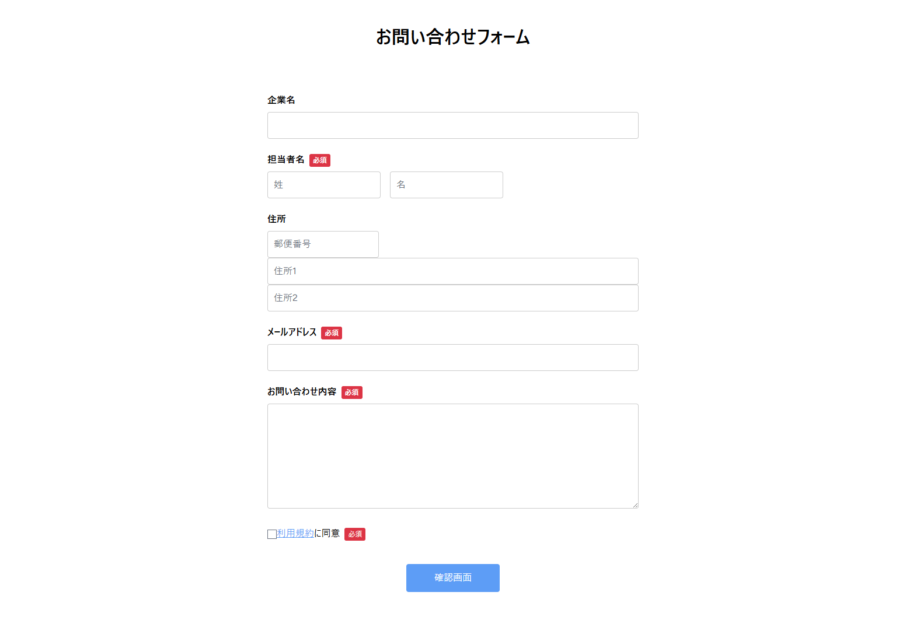
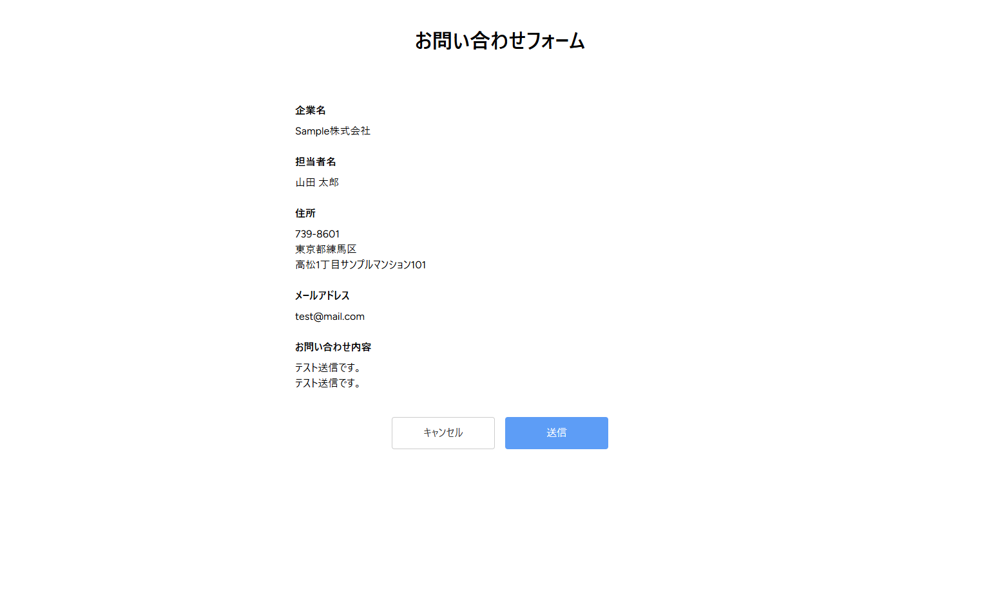
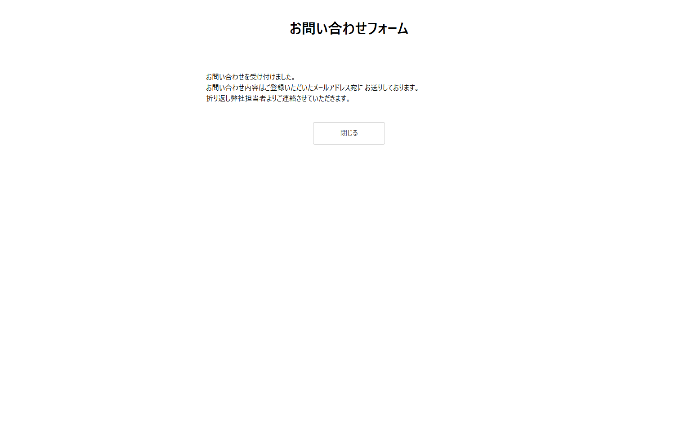

# お問い合わせフォーム

## 概要

※本アプリケーションは企業の選考課題として作成したものです。

Laravel・Inertia.js・Vue 3 を用いて作成したお問い合わせフォームです。

入力画面・確認画面・完了画面の3画面構成となっており、入力内容を確認した上でメールを送信できます。

Docker を利用した開発環境で構築しており、バリデーションや画面遷移など、実際の業務で利用されることを意識して実装しました。

---

## 使用技術

| 技術 | バージョン |
|------|------|
| Laravel | 13.20.0 |
| PHP | 8.3.29 |
| Vue 3 | 3.4.0 |
| Inertia.js | 2.0.0 |
| TypeScript | 5.6.3 |
| Vite | 8.0.0 |
| Docker | 29.1.3 |
| Node.js | 25.2.1 |
| npm | 11.6.2 |

---

## 主な機能

- お問い合わせ入力フォーム
- 必須入力のバリデーション
- 確認画面
- メール送信処理（管理者宛て・問い合わせ者宛て）
- 完了画面
- 確認画面から入力画面へ戻った際の入力内容保持

---

## 画面イメージ

### 入力画面



### 確認画面



### 完了画面



---

## ディレクトリ構成

```text
contact-form-assignment/
├── README.md
├── images/
├── docker/
├── src/
│   ├── app/
│   ├── resources/
│   ├── routes/
│   └── ...
├── docker-compose.yml
└── ...
```

---

## 工夫した点

### 入力内容の保持

確認画面から入力画面へ戻った際に、入力済みの内容が失われないよう実装しました。

Inertia.js の `useForm()` にフォームキーを設定し、ブラウザ履歴を利用した入力内容の保持を実現しています。

### CSSの共通化

画面ごとに重複していたスタイルを共通CSSへまとめ、保守性を向上させました。

### ユーザビリティ

入力内容を確認してから送信できる3画面構成とし、確認画面から戻る場合でも再入力が不要になるよう改善しました。
